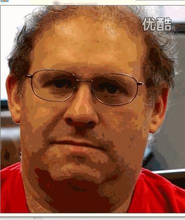

# eulerian_video_magnification
实现欧拉视频放大并用于心率检测等

### 依赖库
opencv2.4.9及以上（后续版本会将opencv中的傅立叶变换替换为FFTW）

### 功能
根据[MIT论文EVM]( http://people.csail.mit.edu/mrub/vidmag/)中的欧拉视频放大原理实现了运动放大和颜色放大两种算法。目前只支持读入视频来实现放大。

### 即将加入的功能
1. 对人脸进行检测和跟踪。
2. 将程序中用到的第三方GraphUtils画图库重构，主要是因为这个库用的是比较老版本的opencv，数据结构和函数接口都是C版本的，很容易出现内存方面的问题，用起来也不方便。
3. 实现心率的检测。
4. MIT之后的论文有实现基于相位的放大，比这个版本更好，因为会把放大的信号加入一个相位平移，从而不会放大噪声，所以之后会考虑实现新版本的程序。

### 效果
##### 原视频

##### 运动放大

##### 颜色放大

